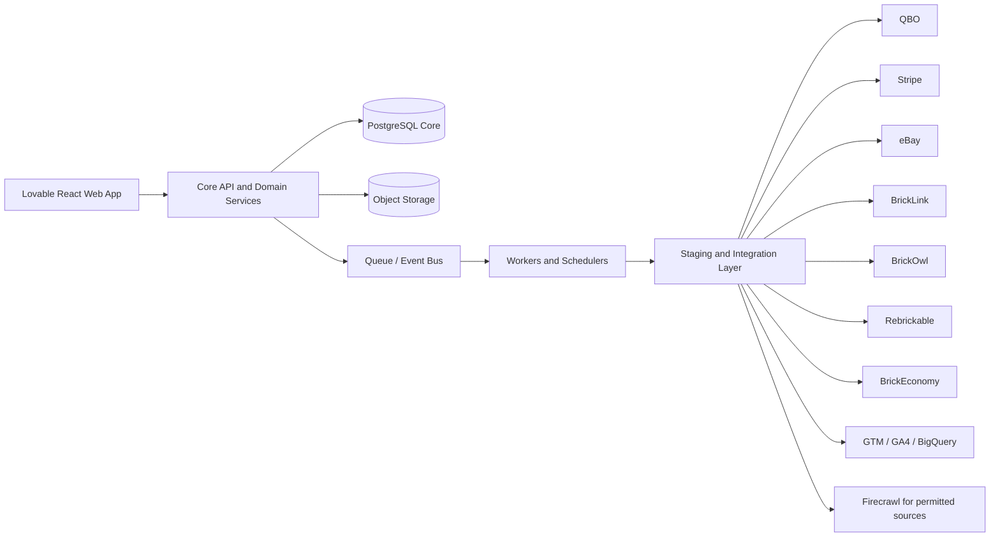

# LEGO Resale Commerce Platform  
## Unified product, solution, technical, and knowledge-base design  
**Version:** 1.0  
**Status:** Revised and refined full design baseline  
**Date:** 9 March 2026  
**Authoring basis:** User-approved revised design, expanded into a full delivery-grade markdown specification

---

## 1. Document purpose

This document defines the target design for a LEGO resale commerce platform that will operate as the primary resale website and operational control plane for stock mastered in QuickBooks Online (QBO), content mastered in the app, and listings distributed to supported channels. It combines:

- knowledge base and domain rules
- product design
- solution architecture
- technical architecture
- operational design
- analytics and reporting design
- governance, audit, and controls

The document is written to be implementation-ready and to serve as a baseline for delivery planning, backlog decomposition, architecture review, and vendor or contractor onboarding.

---

## 2. Executive summary

The platform should be built as an **app-controlled commerce and operations platform** with three clear layers:

1. **Experience layer**  
   A Lovable-built React/Tailwind/Vite web application for the public website and back-office UI.

2. **Domain and orchestration layer**  
   A dedicated backend API and worker tier that owns canonical business logic, inventory operations, content/media management, pricing, listing orchestration, reconciliation, audit, analytics enrichment, and integrations.

3. **Financial and channel layer**  
   QBO, Stripe, eBay, BrickLink, BrickOwl, Rebrickable, BrickEconomy, Google Tag Manager, GA4, and selected permitted web-data collectors, all connected through staging and controlled promotion rules.

The decisive architectural rule is:

> **No external system may write directly into canonical app tables.**  
> Every inbound and outbound integration must pass through landing, staging, validation, mapping, and promotion layers controlled by the app.

This design preserves data integrity, prevents accidental overwrites, gives full auditability, and makes it possible to reconcile channel, finance, and content states into one coherent operating model.

Two core operating decisions govern the design:

- **QBO is the financial and item/SKU master**, but the app owns the **operational subledger** for unit-level stock, landed cost, impairment, reservations, listings, and audit.
- **The app is the master for content, media, SEO, GEO, market data normalisation, wishlists, analytics enrichment, and cross-channel orchestration.**

---

## 3. Key business rules and corrected decisions

### 3.1 Product identifier rules

The canonical LEGO identifier is the **MPN including version suffix**, for example:

```text
MPN = 75367-1
SKU = 75367-1.<condition_grade>
Example SKU = 75367-1.2
```

The version suffix is material and must be treated as part of the canonical identifier because it can affect market price, collectability, and demand.

### 3.2 Condition grades

```text
1 = highest condition
2 = high condition
3 = acceptable condition
4 = lowest saleable condition
5 = non-saleable
```

Grades `1` to `4` are saleable.  
Grade `5` is non-saleable and routes to one of the following disposition paths:

- write-off
- scrap sale
- part-out
- internal hold for review

### 3.3 Rebrickable role

Rebrickable is a **data source**, not a physical-stock sales channel. It should be used for catalogue enrichment, back-catalogue discovery, version-aware MPN coverage, wishlist support, and demand intelligence. Rebrickable explicitly states that it does not sell physical LEGO sets or parts directly and instead links to external stores; it also recommends CSV downloads for bulk catalogue usage.[^rebrickable-buy-parts][^rebrickable-api]

### 3.4 BrickEconomy role

BrickEconomy should be treated as a **strategic valuation input**, not the sole real-time pricing engine. Its official API has a standard rate limit of 100 requests per day.[^brickeconomy-api]

The platform should **not** use Firecrawl or any other scraper to circumvent that limit unless BrickEconomy gives written permission. BrickEconomy’s terms prohibit automated copying without written consent.[^brickeconomy-terms] Firecrawl remains useful as a collection framework for sources where automated extraction is explicitly allowed.[^firecrawl-intro][^firecrawl-extract]

### 3.5 Media mastery

The app must be the sole **media master**. The app owns:

- original uploads
- derivative variants
- primary-image selection
- display order
- alt text
- captions
- focal points
- channel-ready media payloads

Outbound channel projections may transform media, but external systems may not overwrite app media automatically.

### 3.6 Stock adjustment scope

The app must support first-class stock adjustments including:

- shrinkage
- found stock
- damage
- grade downgrade
- devaluation / impairment
- write-off
- scrap sale
- part-out transfer
- return to stock
- stock merge / split
- supplier claim or dispute

### 3.7 Delivery and member benefits

The platform must support:

- free or paid standard delivery, depending on policy
- paid express delivery
- free collection at approved local LEGO club locations

Club collection is available only to eligible signed-in members who choose an approved club destination. Club orders must apply:

- automatic **5% member discount**
- automatic **5% club commission expense**

---

## 4. Business goals

### 4.1 Primary goals

- create a robust and accessible primary resale website
- minimise human intervention across intake, listings, orders, pricing, and reconciliation
- preserve clean financial and stock integrity across all channels
- support condition-sensitive, version-sensitive LEGO resale economics
- expose buying insight from wishlists and market signals
- create strong operational and strategic analytics
- maintain complete traceability for every material event

### 4.2 Secondary goals

- reduce listing effort by mastering content and media once
- reduce pricing errors through rule-driven floor/target/ceiling bands
- improve turn-around of stock through analytics-led repricing and sourcing decisions
- support rapid audit, exception handling, and investigation
- improve discoverability in classic search and AI-assisted search surfaces

### 4.3 Non-goals

The first release should not attempt to:

- let external systems directly own internal statuses
- use Rebrickable as a physical-stock selling channel
- depend on scraping data from sources that disallow it
- collapse unit-level stock into coarse SKU-only inventory operations
- embed integration and configuration tasks inside operational pages

---

## 5. Design principles

1. **App-controlled truth**  
   The app controls canonical data and lifecycle rules.

2. **Operational subledger**  
   Financial systems remain authoritative for accounting, while the app keeps the unit-level operational truth necessary to run the business.

3. **Staged integration only**  
   All external inputs are landed, validated, transformed, and promoted. Nothing writes straight into core tables.

4. **Audit first**  
   Every material event must be traceable from trigger to downstream effects.

5. **Master once, project many**  
   Content, media, SEO/GEO, and pricing policy are mastered centrally and projected outward.

6. **Accessibility by default**  
   Front-end and back-office UX should target WCAG 2.2 AA.[^wcag22][^wcag22-overview]

7. **Analytics as a product feature**  
   Reporting is not an afterthought. It is a core operational capability.

8. **Settings separate from operations**  
   Integrations, schedules, credentials, permissions, mappings, and configuration belong in Settings, not on operational pages.

9. **Automation with visible controls**  
   The system should automate aggressively but never opaquely.

10. **Version-aware LEGO modelling**  
    MPN version suffixes matter and must be preserved everywhere.

---

## 6. Scope

### 6.1 In scope

- public website
- member accounts and wishlists
- direct checkout via Stripe
- stock-unit tracking
- fee apportionment into landed cost
- impairment and write-offs
- media management
- SEO/GEO management
- multi-channel listing orchestration
- eBay integration
- BrickLink integration
- BrickOwl integration
- Rebrickable catalogue integration
- BrickEconomy valuation integration within licence limits
- GTM and GA4 instrumentation
- operational, strategic, digital, and data-operations reporting
- QBO synchronisation and financial posting support
- automated reconciliation and exception management
- cash-sale support as an internal order origin

### 6.2 Out of scope for first release

- native mobile apps
- full marketing automation beyond measurement and reporting
- advanced warehouse robotics or scanning hardware integration
- marketplace expansion beyond the named channels
- broad tax engine replacement
- automated scraping of sources that do not allow it

---

## 7. Domain glossary

### 7.1 Core domain terms

- **MPN**: LEGO identifier including version, for example `75367-1`
- **SKU**: `MPN.grade`, for example `75367-1.3`
- **stock unit**: a single physical item tracked individually
- **catalog product**: the canonical MPN-level product record
- **listing**: a channel-specific sale offer or projected offer
- **reservation**: temporary commitment of stock units prior to final sale or shipment
- **landed cost**: direct purchase cost plus apportioned buying and inbound delivery fees
- **carrying value**: landed cost less accumulated impairment
- **price watch**: persistent price-tracking requirement for an MPN
- **wishlist signal**: member demand captured even without current stock
- **club order**: member order routed to an approved local LEGO club collection point

### 7.2 Financial and reconciliation terms

- **expected settlement**: order gross less estimated or actual fees, refunds, and discounts
- **actual settlement**: deposited or payable amount evidenced by channel or Stripe
- **auto-match**: system-confirmed reconciliation without manual intervention
- **exception case**: unresolved mismatch requiring investigation

---

## 8. System-of-record model

### 8.1 Authoritative ownership

#### QBO is authoritative for

- customer identity
- item and SKU identity
- vendors
- posted accounting transactions
- official book inventory quantity and value
- chart-of-accounts mappings
- accounting document IDs and statuses

QBO supports webhooks, change data capture (CDC), sparse updates, and sync-token concurrency controls. It also documents FIFO for inventory cost accounting and states that inventory adjustments through the inventory-adjustment workflow support **quantity only**, not value, and are supported for **US locales only**.[^qbo-webhooks][^qbo-cdc][^qbo-fifo][^qbo-inv-adjust]

#### The app is authoritative for

- catalogue normalisation
- content and channel copy
- SEO and GEO content
- media assets and ordering
- stock-unit records
- landed-cost apportionment
- impairment and write-off history
- reservations and allocations
- listing orchestration
- price watches and market snapshots
- wishlist and demand signals
- analytics warehouse
- audit trail and raw payload lineage
- operational and strategic status language
- exception management

#### External systems are source feeds or execution surfaces

- **Stripe**: payment and refund execution for direct website orders
- **eBay**: listing, order, fulfilment, payout, fee, and market data
- **BrickLink**: order, inventory, and price-guide data
- **BrickOwl**: inventory sync, orders, and availability/pricing data
- **Rebrickable**: catalogue and back-catalogue data source
- **BrickEconomy**: valuation baseline input
- **Google**: GTM, GA4, Search Console, and BigQuery data sources
- **Firecrawl**: permitted-source collection framework only

### 8.2 Ownership rule

> External systems may influence app state, but they do not own canonical app state.

---

## 9. High-level architecture



### 9.1 Experience layer

The frontend should be built with Lovable because Lovable produces React, Tailwind, and Vite applications and supports OpenAPI-connected architectures.[^lovable-faq]

The experience layer includes:

- public storefront
- member account area
- back-office UI
- analytics dashboards
- admin/settings UI

### 9.2 Domain layer

The domain layer should expose a stable API and enforce:

- validation
- permissions
- lifecycle rules
- data ownership rules
- audit creation
- outbox creation
- pricing logic
- allocation rules
- media projection rules
- reconciliation logic

### 9.3 Data layer

Use PostgreSQL for canonical operational data, plus:

- object storage for media and raw payload blobs
- a queue or event bus for async workers
- a warehouse or analytical schema for reporting
- optional search index for site search and admin lookup performance

### 9.4 Worker tier

Workers handle:

- polling
- webhook processing
- CDC catch-up
- pricing refresh
- listing sync
- media transformation
- reconciliation jobs
- report refresh
- exception escalation
- search index refresh
- scheduled exports

---

## 10. Integration pattern and staging architecture

### 10.1 Mandatory integration flow

Every external system must use the same app-controlled pattern.

#### Inbound

```text
external webhook / poll / export
    -> raw landing table or object storage
    -> staging normalisation table
    -> validation and mapping
    -> duplicate / replay / idempotency checks
    -> promote to canonical tables
    -> create audit event
    -> create outbox messages
    -> update read models and dashboards
```

#### Outbound

```text
internal intent / rule / user action
    -> outbound command table
    -> queue
    -> connector execution
    -> raw response landing
    -> staging confirmation
    -> canonical status update
    -> audit event
    -> exception case if needed
```

### 10.2 Why this is mandatory

This staging pattern is required to:

- prevent accidental external overwrites
- preserve raw evidence of what arrived and what was sent
- decouple external schemas from core schemas
- make retries and replay safe
- support schema drift
- support redelivery and idempotency
- keep investigation practical

### 10.3 Staging schema structure

Recommended inbound schemas:

- `landing_raw_qbo`
- `landing_raw_stripe`
- `landing_raw_ebay`
- `landing_raw_bricklink`
- `landing_raw_brickowl`
- `landing_raw_rebrickable`
- `landing_raw_brickeconomy`
- `landing_raw_google`
- `landing_raw_firecrawl`

Recommended transformed schemas:

- `staging_qbo_*`
- `staging_stripe_*`
- `staging_ebay_*`
- `staging_bricklink_*`
- `staging_brickowl_*`
- `staging_rebrickable_*`
- `staging_brickeconomy_*`
- `staging_google_*`
- `staging_firecrawl_*`

Each staging table should include:

- source system
- source object type
- source object ID
- raw payload checksum
- received timestamp
- parser version
- normalisation status
- validation status
- promotion status
- correlation ID
- replay sequence

### 10.4 Connector-specific approach

#### QBO

Use QBO webhooks as the primary signal and CDC as the catch-up mechanism.[^qbo-webhooks][^qbo-cdc]

#### Stripe

Use webhooks for Checkout Session, PaymentIntent, charge, shipping state, and refunds.

#### eBay

Use Inventory API for listings and quantity updates, Fulfillment API for order completion, and Finances API for payouts and monetary transactions.[^ebay-inventory-overview][^ebay-fulfillment][^ebay-finances]

#### BrickLink

Use Store API for inventory and orders, plus Price Guide endpoints for market pricing. BrickLink’s Price Guide can include or exclude VAT depending on request handling; VAT treatment must be stored explicitly.[^bricklink-api][^bricklink-price-guide]

#### BrickOwl

Use BrickOwl API for order downloads, inventory sync, catalogue availability, and invoice transactions. BrickOwl documents rate limits of 600 requests per minute for most requests and 100 per minute for bulk calls.[^brickowl-api]

#### Rebrickable

Use Rebrickable CSV downloads for full catalogue coverage and API calls for targeted enrichment or user-authorised collection functions.[^rebrickable-api][^rebrickable-downloads]

#### BrickEconomy

Use API calls conservatively for strategic pricing baselines and cache aggressively.[^brickeconomy-api]

#### Google

Use GTM data layer events, GA4 web collection, Measurement Protocol for server-side events, BigQuery export, and Search Console bulk export where useful.[^gtm-datalayer][^ga4-ecommerce][^ga4-mp][^ga4-bq][^gsc-bulk]

#### Firecrawl

Use only for sources where automated extraction is permitted, and store the licence basis or permission basis against each connector.[^firecrawl-intro][^firecrawl-extract]

---

## 11. Canonical lifecycle model

### 11.1 Stock-unit lifecycle

- `pending_receipt`
- `received`
- `awaiting_grade`
- `graded`
- `available`
- `reserved`
- `allocated`
- `picked`
- `packed`
- `shipped`
- `delivered`
- `returned`
- `awaiting_disposition`
- `scrap`
- `part_out`
- `written_off`
- `closed`

### 11.2 Listing lifecycle

- `draft`
- `price_pending`
- `media_pending`
- `copy_pending`
- `approval_pending`
- `publish_queued`
- `live`
- `paused`
- `suppressed`
- `ended`
- `archived`

### 11.3 Order lifecycle

- `pending_payment`
- `authorised`
- `paid`
- `picking`
- `packed`
- `awaiting_dispatch`
- `shipped`
- `complete`
- `cancelled`
- `partially_refunded`
- `refunded`
- `exception`

### 11.4 Settlement lifecycle

- `awaiting_source_data`
- `expected_amount_computed`
- `actual_amount_received`
- `fees_matched`
- `refunds_matched`
- `posted_to_qbo`
- `reconciled`
- `variance_exception`
- `closed`

### 11.5 Status mapping rule

External statuses are always stored, but the UI should show **canonical statuses first** and only expose raw channel statuses where operationally useful.

---

## 12. Core data model

### 12.1 Domain groups

#### Catalogue and master data

- `catalog_product`
- `sku`
- `source_identity`
- `product_attribute`
- `catalog_relationship`
- `theme`
- `brand`
- `version_note`

#### Content, SEO, and media

- `content_document`
- `content_revision`
- `seo_document`
- `seo_revision`
- `faq_block`
- `media_asset`
- `media_collection`
- `media_slot`
- `media_variant`
- `channel_media_projection`

#### Inventory and valuation

- `inbound_receipt`
- `inbound_receipt_line`
- `allocable_fee`
- `fee_allocation`
- `stock_unit`
- `stock_movement`
- `stock_adjustment`
- `valuation_adjustment`
- `reservation`
- `location`
- `disposition_batch`
- `partout_transfer`
- `partout_child_unit`

#### Commerce

- `sales_order`
- `sales_order_line`
- `shipment`
- `payment`
- `refund`
- `discount`
- `shipping_charge`
- `club_commission_accrual`

#### Channels

- `channel_account`
- `channel_listing`
- `channel_listing_revision`
- `channel_price_band`
- `channel_sync_state`
- `channel_fee_schedule`
- `shipping_rate_table`

#### Market and demand

- `wishlist`
- `wishlist_item`
- `price_watch`
- `price_snapshot`
- `price_forecast`
- `market_signal`
- `source_confidence`
- `buy_opportunity_score`

#### Governance and integration

- `audit_event`
- `raw_payload`
- `job_run`
- `outbound_command`
- `exception_case`
- `approval_task`
- `integration_health`
- `dead_letter_event`

### 12.2 Key canonical tables

#### `catalog_product`

Purpose: one record per LEGO MPN including version suffix.

Key fields:

- `catalog_product_id`
- `mpn`
- `product_type`
- `name`
- `theme_id`
- `brand_id`
- `retired_flag`
- `release_year`
- `version_descriptor`
- `rebrickable_id`
- `brickeconomy_id`
- `bricklink_item_no`
- `brickowl_boid`
- `status`

#### `sku`

Purpose: one record per saleable or non-saleable condition variant.

Key fields:

- `sku_id`
- `catalog_product_id`
- `sku_code`
- `condition_grade`
- `saleable_flag`
- `qbo_item_id`
- `default_pack_cost`
- `default_handling_cost`
- `listing_template_id`
- `active_flag`

#### `stock_unit`

Purpose: one record per physical unit.

Key fields:

- `stock_unit_id`
- `sku_id`
- `mpn`
- `condition_grade`
- `receipt_id`
- `receipt_line_id`
- `landed_cost`
- `accumulated_impairment`
- `carrying_value`
- `status`
- `location_id`
- `reservation_id`
- `supplier_id`
- `serial_or_internal_mark`
- `notes`
- `evidence_media_collection_id`

#### `channel_listing`

Purpose: one record per app-managed listing concept.

Key fields:

- `channel_listing_id`
- `channel`
- `sku_id`
- `listing_scope`
- `status`
- `published_quantity`
- `price_floor`
- `price_target`
- `price_ceiling`
- `current_price`
- `external_listing_id`
- `external_offer_id`
- `media_projection_id`
- `copy_revision_id`

#### `sales_order`

Purpose: canonical order model for web, channel, and cash sales.

Key fields:

- `sales_order_id`
- `origin_channel`
- `origin_reference`
- `customer_id`
- `member_id`
- `status`
- `currency`
- `merchandise_subtotal`
- `discount_total`
- `shipping_total`
- `tax_total`
- `gross_total`
- `club_id`
- `club_discount_amount`
- `club_commission_amount`
- `payment_reference`

#### `audit_event`

Purpose: immutable evidence trail.

Key fields:

- `audit_event_id`
- `entity_type`
- `entity_id`
- `trigger_type`
- `actor_type`
- `actor_id`
- `source_system`
- `correlation_id`
- `causation_id`
- `before_json`
- `after_json`
- `input_json`
- `output_json`
- `diff_json`
- `checksum`
- `parser_version`
- `job_run_id`
- `occurred_at`

### 12.3 Indexing priorities

Create indexes for:

- `mpn`
- `sku_code`
- `qbo_item_id`
- `source_object_id`
- `status`
- `received_at`
- `updated_at`
- `correlation_id`
- `member_id`
- `club_id`
- `channel`
- `external_listing_id`
- `external_order_id`
- `payout_id`

Use partitioning for high-volume tables such as:

- `audit_event`
- `raw_payload`
- `price_snapshot`
- `ga4_event_fact`
- `sales_order_line_fact`
- `stock_movement`

---

## 13. Inventory, costing, and valuation design

### 13.1 Why an operational subledger is required

QBO documents FIFO for inventory cost accounting, but the QBO inventory-adjustment workflow supports quantity adjustments only and is US-only.[^qbo-fifo][^qbo-inv-adjust] That is not sufficient for the operating model required here, because the platform must support:

- unit-level landed cost
- per-unit condition
- per-unit reservations
- devaluation and impairment
- part-out transfers
- scrap and recovery proceeds
- evidence-backed write-offs
- cross-channel allocations

Therefore the app must maintain an operational subledger and reconcile its rolled-up book view to QBO.

### 13.2 Receipt ingestion

When a stock-bearing purchase arrives from QBO or an approved intake workflow:

1. Create `inbound_receipt`
2. Import or normalise receipt lines
3. Identify stock lines vs allocable fee lines
4. Create `allocable_fee` records
5. Apportion fees to stock lines
6. Explode stock lines into one `stock_unit` per physical unit
7. Set initial statuses to `received` or `awaiting_grade`
8. Create audit events and cost traces

### 13.3 Fee apportionment

Fees to include in landed cost:

- buying fees
- inbound delivery fees
- other approved allocable acquisition costs

Default apportionment method:

```text
line_weight = stock_line_extended_cost / sum(all_stock_line_extended_cost)
allocated_fee_to_line = fee_total * line_weight
unit_landed_cost = (stock_line_extended_cost + allocated_fee_to_line) / quantity
```

Alternative apportionment modes may be supported later:

- weight-based
- unit-count based
- volumetric
- custom supplier rule

### 13.4 Landed cost, impairment, and carrying value

Use immutable landed cost plus separate impairment.

```text
landed_cost = original direct cost + allocated acquisition fees
carrying_value = landed_cost - accumulated_impairment
```

This preserves historical truth while allowing devaluation without corrupting receipt history.

### 13.5 FIFO and weighted average

FIFO is the **issue rule** for:

- sales
- write-offs
- scrap transfers
- part-out transfers
- bulk liquidation allocations

Weighted average is a **reporting metric** on open stock only.

```text
wac_landed_on_hand = sum(open unit landed_cost) / count(open units)
wac_carrying_on_hand = sum(open unit carrying_value) / count(open units)
```

This satisfies the requirement to track weighted average cost of current stock in hand while maintaining FIFO truth at unit level.

### 13.6 Grading and regrading

A unit may be regraded. Regrading creates:

- a stock movement
- optional valuation adjustment
- optional listing eligibility recalculation
- an audit trail with evidence
- optional approval requirement depending on severity

Examples:

- grade `2` to grade `3` after inspection
- grade `4` to grade `5` after damage
- grade `5` to grade `4` after restoration or re-evaluation

### 13.7 Stock adjustments

Stock adjustments must be first-class records with:

- reason code
- evidence
- actor
- approval status
- QBO posting consequence
- affected units
- before/after state

#### Adjustment reason codes

- `shrinkage`
- `found_stock`
- `damage`
- `grading_error`
- `devaluation`
- `write_off`
- `scrap_sale`
- `part_out_transfer`
- `supplier_credit_pending`
- `return_to_stock`

### 13.8 Valuation adjustments

A valuation adjustment should not change the original landed cost. It should:

- create an impairment entry
- reduce carrying value
- record basis and reason
- link to evidence and approval
- optionally post accounting consequence to QBO

### 13.9 Part-out flow

When a unit is better monetised through part-out:

1. mark original unit as `part_out`
2. close the parent unit
3. create child units for recoverable components if required by the business model
4. allocate parent carrying value across children using configured rules
5. create a `partout_transfer`
6. write audit, lineage, and QBO adjustment records as required

### 13.10 Scrap and recovery

For grade `5` stock, a disposition decision matrix should choose between:

- write-off with zero recovery
- scrap sale with recovery proceeds
- part-out
- hold for later re-evaluation

---

## 14. Pricing intelligence and market-data design

### 14.1 Price-watch universe

Every MPN that has ever been:

- held in stock, or
- requested by a member,

must automatically create a `price_watch`.

### 14.2 Source priority

Recommended source order:

1. internal realised sales and contribution margin
2. eBay realised sales and competitiveness
3. BrickLink price guide
4. BrickOwl availability and pricing signals
5. BrickEconomy valuation baseline
6. Rebrickable catalogue context

Rebrickable is not a price execution source. It is a catalogue and structural data source.[^rebrickable-api]

### 14.3 Refresh tiers

#### Tier A
Items that are:
- currently stocked
- currently listed
- top-wishlist
- under active repricing

#### Tier B
Items that are:
- wished but not stocked
- recently stocked
- strategic buy targets

#### Tier C
Dormant historical items

### 14.4 Source caveats

- BrickEconomy is rate-limited and should be cached.[^brickeconomy-api]
- BrickLink VAT handling must be normalised explicitly.[^bricklink-price-guide][^bricklink-changelog]
- BrickOwl availability should be treated as a signal, not absolute market coverage.[^brickowl-api]
- eBay listing and transaction data should be weighted by relevance to grade and completeness.
- User-requested or manually entered pricing overrides must be traceable.

### 14.5 Channel cost model

Per channel, compute:

```text
cost_base =
  carrying_value
  + packaging_cost
  + estimated_standard_delivery_cost
  + estimated_channel_fees
  + estimated_payment_fees
  + risk_reserve
```

```text
floor_price =
  (cost_base + minimum_profit_amount) / (1 - minimum_margin_rate)
```

```text
target_price =
  market_consensus
  * demand_multiplier
  * stock_age_multiplier
  * condition_multiplier
  * turnaround_multiplier
```

```text
ceiling_price =
  max(floor_price, strategic_hold_value)
```

### 14.6 Pricing outputs

For each SKU and channel, store:

- floor price
- target price
- ceiling price
- current publish price
- expected gross margin
- expected net margin
- estimated days to sale
- confidence score
- source divergence score
- repricing recommendation
- override reason if manually changed

### 14.7 Grade-aware pricing

Condition grade must directly affect:

- price multiplier
- desirability score
- expected days to sell
- eligible channels
- media/copy requirements
- refund risk reserve

Grade `5` is non-saleable and excluded from standard listings.

---

## 15. Listings and channel orchestration

### 15.1 Listing model

The app should manage one canonical listing concept and project it into each external channel.

A canonical listing is composed of:

- MPN and SKU identity
- quantity budget
- price bands
- copy revision
- media projection
- shipping profile
- return/refund profile
- channel-specific mapping and state

### 15.2 Availability allocator

The platform needs a single allocator service that prevents oversell across all channels.

It must consider:

- physical stock on hand
- reserved stock
- allocated stock
- pick/pack delay
- cancellation lag
- returns in transit
- safety buffer
- per-channel quantity caps

For eBay, the app must respect the distinction between total inventory quantity and marketplace offer quantity that eBay documents in the Inventory API.[^ebay-offer-qty][^ebay-inventory-item]

### 15.3 Listing publication flow

1. select eligible units or quantity pool
2. validate media, copy, and price
3. compute channel payload
4. create `outbound_command`
5. send to channel
6. land response in raw/staging
7. promote resulting external IDs
8. mark listing `live`
9. update sync state and audit history

### 15.4 Channel capabilities

#### Website
- full content and media control
- direct checkout via Stripe
- member wishlist and club collection

#### eBay
- inventory item, offer, fulfilment, and finances support
- media URLs supported in listing payloads
- revisions limited by eBay’s revision rules, which need to be respected by scheduling and batching logic[^ebay-publish-offer][^ebay-images]

#### BrickLink
- inventory and order support
- catalogue image references
- price guide support
- treat custom media capabilities conservatively unless proven in working integration

#### BrickOwl
- inventory sync and order processing
- catalogue availability
- use external lot IDs for durable mapping
- media support should be modelled via channel capability configuration and validated in implementation

### 15.5 Listing suppression and errors

A listing should be automatically suppressed or paused if:

- price falls below floor without override
- required media is missing
- channel returns validation errors
- stock drops below safe publish quantity
- unit is regraded to non-eligible condition
- seller policy changes invalidate payload
- channel credential health fails

### 15.6 Listings studio UI

The main Listings page should focus only on operations:

- listing coverage
- live vs draft vs failed
- sync health
- price exceptions
- media completeness
- publish queue
- bulk actions

Integration credentials, schedules, mappings, and permissions must sit in **Settings**, not here.

---

## 16. Content, media, SEO, and GEO design

### 16.1 Content mastery

The app should master content in versioned documents:

- title
- short description
- long description
- condition notes
- what's included / missing
- pricing rationale summary for internal use
- FAQ blocks
- structured data payload
- channel variants
- moderation and approval status

Each content revision should know:

- who changed it
- what changed
- why it changed
- which channels it was projected to
- whether it was AI-assisted or human-edited

### 16.2 Media model

#### `media_asset`
Stores:
- original binary
- checksum
- MIME type
- size
- width/height
- created by
- provenance
- copyright or rights note

#### `media_collection`
Logical group attached to:
- product
- SKU
- listing template
- stock unit
- evidence bundle

#### `media_slot`
Stores:
- collection ID
- slot number
- is primary
- alt text
- caption
- focal point
- publish eligibility

#### `media_variant`
Stores generated derivatives:
- square crop
- portrait crop
- landscape crop
- channel-specific size
- watermark rule if used
- compression profile

#### `channel_media_projection`
Stores the exact ordered payload sent to a channel.

### 16.3 Media rules

- slot `1` is always primary
- channel projections preserve app slot order
- projection rules enforce per-channel image limits
- any outbound truncation is logged
- inbound channel-side image changes are staged but never auto-promoted
- media variants are reproducible from source asset and transformation rules
- app-owned alt text is preserved wherever the destination supports it

eBay supports image URLs on inventory items and related listing constructs.[^ebay-images][^ebay-inventory-imageurls]

### 16.4 SEO design

SEO must be app-mastered in versioned `seo_document` records.

Each SEO record should include:

- canonical URL
- title tag
- meta description
- indexation policy
- Open Graph tags
- X/Twitter card tags
- breadcrumb metadata
- product structured data
- offer structured data
- FAQ structured data where appropriate
- image metadata
- robots directives
- sitemap inclusion rules

Use one canonical product URL per MPN, for example:

```text
/sets/75367-1/<slug>
```

Condition grades should normally be rendered as offer variants on the canonical product page, not as separate thin indexable pages, unless a deliberate SEO strategy requires otherwise.

### 16.5 GEO design

For this design, **GEO** means **generative-engine optimisation** or AI-discovery optimisation. The content model should be designed so that AI-assisted search surfaces can extract accurate facts, comparisons, and answer blocks from pages. Google’s AI-search guidance makes clear that AI features such as AI Overviews and AI Mode surface links to relevant pages, and Google also states that structured data helps its systems understand page content.[^google-ai-features][^google-structured-data][^google-product-sd]

GEO should therefore include:

- concise answer blocks
- structured product facts
- version-aware identifiers
- visible condition explanations
- complete media context
- availability and price data consistent with visible page content
- FAQ sections based on real user questions
- provenance and completeness notes

### 16.6 SEO/GEO page families

- product pages
- theme pages
- retired-set pages
- demand-insight pages
- grading guide pages
- shipping and collection policy pages
- club collection pages
- blog or buying-guide pages
- sourcing-insight pages where strategically useful

### 16.7 Structured data

Use JSON-LD with at least:

- `Product`
- `Offer`
- `BreadcrumbList`
- `FAQPage` where appropriate
- `Organization` / store identity
- image metadata where supported

Google and Schema.org both document Product and Offer structured data support.[^google-product-sd][^schema-product][^schema-offer]

### 16.8 Sitemap and search-engine controls

Implement:

- XML sitemaps by page family
- robots rules by route family
- canonical tags
- pagination strategy
- faceted-navigation rules
- noindex policy for thin or user-private pages

Google documents sitemap formats, sitemap submission, and structured data guidelines.[^google-sitemap][^google-sd-guidelines]

### 16.9 SEO/GEO content governance

The app should enforce:

- approval workflow for high-value pages
- change diffs
- structured-data validation status
- missing-field completeness scores
- stale content alerts
- landing-page performance feedback into content backlog

---

## 17. Website, checkout, delivery, and club-order design

### 17.1 Website capabilities

Public users should be able to:

- browse and search catalogue
- filter by theme, grade, availability, retired status, and price
- view detailed MPN pages
- see stock offers by condition
- add to basket
- check out as guest or member
- sign up for an account
- create or manage wishlist
- request stock alerts

Members should additionally be able to:

- save addresses
- manage profile
- manage wishlist
- see order history
- access club collection where eligible
- receive targeted stock alerts

### 17.2 Stripe integration

Use Stripe for:

- checkout
- discounts
- promotion codes
- payment capture
- refunds
- shipping-rate selection
- metadata-based reconciliation

Stripe supports Checkout Sessions, metadata on relevant objects, shipping rates, promotion codes, and partial or multiple refunds up to the full amount.[^stripe-checkout][^stripe-metadata][^stripe-shipping-rates][^stripe-refunds]

### 17.3 Embedded checkout recommendation

Use **embedded Checkout** rather than only Stripe-hosted Checkout because dynamic shipping option updates by address are documented for embedded Checkout, not Stripe-hosted Checkout.[^stripe-embedded][^stripe-dynamic-shipping]

This matters because club collection eligibility depends on member and destination rules.

### 17.4 Delivery modes

#### Standard delivery
May be free or paid depending on rule set.

#### Express delivery
Paid premium option.

#### Club collection
Free collection at an approved local LEGO club destination, member-only.

### 17.5 Delivery rule engine

A dedicated shipping policy engine should evaluate:

- member status
- basket contents
- destination country
- delivery address
- club eligibility
- basket value
- free-shipping threshold
- excluded items or dimensions
- express availability
- stock location

### 17.6 Club collection model

Required entities:

- `club`
- `club_location`
- `club_delivery_rule`
- `club_collection_window`
- `club_commission_rule`
- `member_club_link`
- `club_order_benefit`

### 17.7 Club order commercial logic

Default rule:

```text
club_discount = 5% of merchandise subtotal before shipping
club_commission = 5% of post-discount merchandise subtotal before shipping
```

These should be configurable in Settings.

### 17.8 Club order flow

1. member logs in
2. member selects approved club collection option
3. shipping engine confirms eligibility
4. delivery option changes to zero-cost collection
5. 5% member discount applies automatically
6. club commission accrual is created automatically
7. order confirmation includes club collection instructions
8. settlement and reporting track the club economics end to end

### 17.9 Refunds and club orders

Refund logic must handle:

- full refunds
- partial refunds
- post-discount refund basis
- club commission reversal or adjustment
- inventory return-to-stock decision
- evidence and note capture

---

## 18. QBO, finance posting, and reconciliation design

### 18.1 Finance integration principles

- QBO remains the financial book of record
- app subledger must reconcile to QBO
- operational stock adjustments must be posted to QBO in a controlled way
- QBO updates must use proper webhook, CDC, and sync-token patterns[^qbo-webhooks][^qbo-cdc][^qbo-errors]

### 18.2 Posting categories

The app should support accounting consequences for:

- purchases and receipts
- stock adjustments
- write-offs
- impairment or devaluation
- sales
- shipping income
- discounts
- refunds
- club commission expense
- channel fees
- payout clearing and settlement

### 18.3 Reconciliation model

For each order or settlement batch, compute:

- expected gross sales
- expected discounts
- expected shipping income
- expected channel fees
- expected payment fees
- expected refunds
- expected club commission
- expected net settlement

Then match against actuals imported from:

- Stripe
- eBay Finances
- BrickOwl invoice transactions
- bank feed or QBO deposit records where applicable

eBay’s Finances API exposes payouts and monetary transactions, which makes it suitable for automated settlement reconciliation.[^ebay-finances][^ebay-payouts][^ebay-transactions]

### 18.4 Auto-match logic

Auto-match when:

- order or payout references align
- amount variance is within tolerance
- currency matches
- fee pattern fits known schedule
- refund state is complete
- duplicate risk is ruled out

Create exception if:

- payout missing beyond SLA
- amount mismatch outside tolerance
- unexpected fee types
- stale or conflicting references
- duplicate settlement candidates
- order partially represented

### 18.5 Exception inbox

Exception management should include:

- severity
- suspected root cause
- impacted entities
- recommended next action
- owner
- SLA clock
- full evidence bundle
- close code

---

## 19. Product design: front-end and back-office UX

### 19.1 UX principles

- fast to scan
- keyboard accessible
- low-friction bulk operations
- clear status semantics
- minimal page clutter
- settings separated from operations
- drill from summary to evidence in one or two clicks

### 19.2 Public information architecture

- Home
- Search / browse
- Product page
- Basket
- Checkout
- Sign in / sign up
- Member account
- Wishlist
- Stock alerts
- Delivery and collection information
- Grading guide
- FAQ / help

### 19.3 Back-office information architecture

#### Operational navigation
- Dashboard
- Intake
- Inventory
- Listings
- Orders
- Reconciliation
- Demand
- Analytics
- Audit explorer

#### Settings navigation
- Integrations
- Credentials
- Sync schedules
- Permissions and roles
- Pricing rules
- Shipping tables
- Channel fee schedules
- Club configuration
- QBO mappings
- SEO templates
- Media presets
- Notification rules
- Audit retention and export policies

This split is deliberate and should not be blurred.

### 19.4 Table pattern standards

Every operational table must support:

- sortable columns
- filterable columns
- column visibility control
- checkbox selection
- select one / many / all
- bulk actions
- saved views
- export
- quick actions
- deep-linked filters
- row-level audit link

### 19.5 Record 360 view

Every record should expose a drill-in view showing:

- current canonical status
- source system references
- trigger
- input payload
- output payload
- before/after diff
- downstream effects
- related jobs
- retry history
- approvals
- audit trail
- related orders / payouts / stock units / listings

### 19.6 Responsiveness

All UI should adapt gracefully across:

- desktop
- tablet
- mobile

Lovable is explicitly web-focused rather than native-mobile focused, so this should be implemented as responsive web design rather than separate native mobile apps.[^lovable-faq]

### 19.7 Accessibility

Target WCAG 2.2 AA throughout.[^wcag22][^wcag22-rec]

Key requirements:

- semantic HTML
- visible focus states
- keyboard support
- appropriate contrast
- non-colour status cues
- clear validation messages
- proper labels and instructions
- accessible data-table patterns
- target sizes suited to touch interfaces
- error summary handling
- motion control where relevant

---

## 20. Roles and permissions

### 20.1 Role model

#### Anonymous customer
- browse
- search
- basket
- guest checkout
- sign up

#### Member
- all anonymous capabilities
- wishlist
- order history
- stock alerts
- club collection if eligible
- saved addresses
- profile management

#### Staff
- intake
- grading
- listing operations
- pick/pack/ship
- refunds
- exception handling within scope
- operational dashboards
- record audit visibility

#### Admin
- all staff capabilities
- settings
- role management
- financial mappings
- advanced audit exports
- pricing-rule management
- channel configuration
- approval override
- strategic analytics

### 20.2 Permission model

Use role-based access control with policy scopes such as:

- `inventory.read`
- `inventory.adjust`
- `inventory.writeoff.approve`
- `listing.publish`
- `pricing.override`
- `order.refund`
- `reconciliation.resolve`
- `settings.integrations.manage`
- `settings.roles.manage`
- `audit.export`
- `analytics.strategic.read`

### 20.3 Sensitive actions

Require step-up confirmation or approval for:

- write-offs above threshold
- large impairments
- below-floor pricing
- credential changes
- schedule changes
- payout-match overrides
- mass listing end actions
- bulk media replacement
- permission changes

---

## 21. Analytics and reporting architecture

### 21.1 Design principle

Reporting must combine:

- operational data from the app
- financial outcomes from QBO and settlement sources
- digital behaviour from GTM/GA4
- search discoverability data from Search Console
- market data from channel and pricing sources

### 21.2 Analytics layers

#### Operational read models
Fast, current-state views for the UI.

#### Warehouse fact model
Time-series and event-level analytics.

#### Executive marts
Curated business metrics with agreed definitions.

#### Decision-support outputs
Predictions and recommendations.

### 21.3 Fact tables

- `fact_stock_movement`
- `fact_stock_adjustment`
- `fact_valuation_adjustment`
- `fact_order_line`
- `fact_payment`
- `fact_refund`
- `fact_payout_fee`
- `fact_listing_state`
- `fact_price_snapshot`
- `fact_price_forecast`
- `fact_wishlist_signal`
- `fact_ga4_event`
- `fact_search_console_landing_page`

### 21.4 Dimensions

- date
- week
- month
- quarter
- MPN
- SKU
- condition grade
- theme
- supplier
- channel
- customer/member
- club
- stock age band
- retirement status
- location
- source confidence band

---

## 22. Detailed operational reporting

### 22.1 Intake and procurement

Metrics:

- receipts by supplier
- average receipt size
- fee-apportionment completion rate
- receipt-to-grade SLA
- receipt-to-list SLA
- receipt exception rate
- cost variance by supplier
- inbound freight ratio
- items lacking media after intake
- items lacking price-watch after intake
- purchase approval turnaround
- supplier defect or dispute rate

Views:

- receipt backlog
- grading queue
- media-completion queue
- intake exception queue

### 22.2 Inventory health

Metrics:

- on-hand units by MPN, SKU, grade, location
- landed value on hand
- carrying value on hand
- weighted average landed cost
- weighted average carrying value
- age bands
- reserved stock %
- idle stock %
- grade distribution
- shrinkage rate
- found-stock rate
- write-off rate
- impairment trend
- stock with no active channel listing
- stock with incomplete media
- stock with incomplete SEO

Views:

- ageing matrix
- grade distribution heatmap
- write-off candidates
- dormant stock list
- part-out candidate list

### 22.3 Listings and pricing

Metrics:

- listing coverage by channel
- media completeness by listing
- content completeness by listing
- below-floor overrides
- stale price snapshots
- source divergence
- suppressed listings
- publish success rate
- sync lag
- pricing change frequency
- realised vs target price
- days on channel before sale

Views:

- repricing queue
- failed publications
- low-confidence price band queue
- channel coverage gaps
- competitive risk watchlist

### 22.4 Orders and fulfilment

Metrics:

- orders by origin
- guest vs member split
- member conversion
- average order value
- basket composition
- pick SLA
- pack SLA
- ship SLA
- split shipment rate
- fulfilment exception rate
- refund rate
- refund reason mix
- return-to-stock recovery rate
- club order share
- standard vs express vs collection mix

Views:

- today’s dispatch queue
- at-risk SLA queue
- refunds pending action
- club handover queue
- unallocated order lines

### 22.5 Finance and settlement

Metrics:

- gross sales
- discount total
- shipping revenue
- channel fees
- payment fees
- club commission expense
- COGS
- impairment expense
- write-off expense
- expected margin
- realised margin
- net margin after club commission
- payout lag
- auto-match rate
- unmatched settlement count
- aged exceptions

Views:

- settlement dashboard
- payout variance queue
- unreconciled fee queue
- club commission payable report
- QBO posting backlog

### 22.6 Data operations and integration health

Metrics:

- webhook latency
- CDC drift
- poll latency
- staging backlog
- parse failure rate
- promotion failure rate
- dead-letter volume
- retry volume
- connector health state
- schedule success rate
- schema drift incidents

Views:

- connector health board
- failing jobs
- stale connectors
- unactioned dead-letter events

---

## 23. Strategic reporting

### 23.1 Sourcing intelligence

Metrics:

- most-wished unstocked MPNs
- wishlist velocity
- stockout demand
- realised resale spread vs acquisition cost
- supplier yield by margin band
- buy-opportunity score
- expected turn rate by MPN
- price appreciation / depreciation trend
- retirement premium opportunity

Outputs:

- suggested buy list
- suggested max bid or buy price
- avoid-buy list
- hold vs liquidate list

### 23.2 Commercial strategy

Metrics:

- GMROI by MPN, theme, grade, channel
- sell-through by age band
- price elasticity by theme
- markdown effectiveness
- floor override impact
- realised vs forecast days to sale
- carrying-value exposure by age band
- contribution margin after all fees

Outputs:

- recommended markdown schedule
- recommended floor-policy changes
- inventory liquidation candidates
- premium-hold candidates

### 23.3 Channel strategy

Metrics:

- net margin by channel
- sell-through by channel
- refund and cancellation cost by channel
- payout speed by channel
- fee leakage by channel
- labour-intensity proxy by channel
- oversell risk by channel
- listing success/failure rate by channel

Outputs:

- best channel per grade
- best channel per MPN or theme
- channel exit or deprioritisation alerts
- channel-specific pricing policy recommendations

### 23.4 Member and club economics

Metrics:

- repeat purchase rate
- wishlist-to-order conversion
- club collection adoption
- club discount cost
- club commission cost
- club order margin
- retention by club
- revenue by club
- club pickup failure rate
- time-to-pickup

Outputs:

- best-performing clubs
- underperforming clubs
- club viability by region
- member cohort opportunity report

### 23.5 Governance and risk

Metrics:

- shrinkage hotspots
- write-off trend
- impairment trend
- manual override frequency
- critical exceptions by queue
- audit coverage %
- stale unresolved exceptions
- permissions changes
- unusual after-hours adjustments
- repeated connector failure clusters

Outputs:

- control-risk heatmap
- high-risk stock classes
- high-risk operational workflows
- audit-prep pack

---

## 24. GTM, GA4, and digital analytics design

### 24.1 GTM design

Google Tag Manager should be used as the client-side measurement control plane. Google documents the `dataLayer` as the transport object for passing variables and events to tags.[^gtm-datalayer]

The site should emit a disciplined `dataLayer` event model rather than ad hoc tag logic.

### 24.2 Core GA4 ecommerce events

Track at minimum:

- `view_item_list`
- `select_item`
- `view_item`
- `search`
- `add_to_cart`
- `begin_checkout`
- `add_shipping_info`
- `add_payment_info`
- `purchase`
- `refund`

Google documents ecommerce measurement and recommended events for GA4.[^ga4-ecommerce][^ga4-events]

### 24.3 Business-specific custom events

Track custom events such as:

- `add_to_wishlist`
- `wishlist_backcatalog_add`
- `condition_filter_used`
- `grade_selected`
- `club_collection_selected`
- `club_discount_applied`
- `stock_alert_subscribed`
- `market_price_viewed`
- `faq_expand`
- `seo_landing_engaged`
- `delivery_option_changed`
- `collection_point_selected`

### 24.4 Item-scoped parameters

Send item-level parameters such as:

- `mpn`
- `sku`
- `condition_grade`
- `theme`
- `stock_age_band`
- `retired_flag`
- `margin_band`
- `price_confidence_band`

### 24.5 User-scoped and event-scoped parameters

Where appropriate and privacy-safe:

- `member_status`
- `club_id`
- `club_eligible`
- `customer_type`
- `page_template`
- `landing_page_family`
- `search_type`
- `entry_channel_group`

GA4 also supports user ID collection for signed-in experiences.[^ga4-userid]

### 24.6 Server-side measurement

Use GA4 Measurement Protocol for server-side or offline events that do not reliably originate in the browser, such as:

- refund completion
- club commission creation
- manual stock-adjustment approval
- back-in-stock fulfilment notification
- exception closure events
- cash sale completion

Google documents Measurement Protocol as a way to send server-to-server and offline interactions to GA4.[^ga4-mp]

### 24.7 BigQuery export

Link GA4 to BigQuery and make BigQuery the reporting bridge between digital analytics and operational data. Google documents raw-event export to BigQuery for GA4.[^ga4-bq][^ga4-bq-help]

### 24.8 Search Console integration

Use Search Console bulk export to BigQuery for:

- query-to-landing analysis
- landing-page organic click trends
- discoverability of product and guide pages
- SEO/GEO opportunity identification

Google documents Search Console bulk export and recommends BigQuery as the most effective way to combine Search Console and Google Analytics data.[^gsc-bulk][^gsc-join-ga]

### 24.9 Digital insight examples

- wishlist adds by landing page family
- conversion by content completeness score
- organic conversion by product-page template
- search exits on no-stock items
- club collection selection by geography
- FAQ interaction vs conversion
- media-slot engagement vs add-to-cart rate

---

## 25. Audit, traceability, and explainability

### 25.1 Audit principle

Every material action must answer:

- what triggered this?
- who or what executed it?
- what data came in?
- what data changed?
- what was sent out?
- what downstream effects occurred?

### 25.2 Required audit payload

Each audit event should contain:

- entity type
- entity ID
- trigger type
- actor type and ID
- source system
- correlation ID
- causation ID
- input payload
- output payload
- before snapshot
- after snapshot
- diff
- parser or rule version
- checksum
- job run reference
- timestamp

### 25.3 Raw payload retention

Store raw payloads separately from canonical tables but link them via:

- source object ID
- checksum
- audit event ID
- job run ID
- connector version

### 25.4 Explainability in the UI

Staff and admins must always be able to open a record and inspect:

- timeline
- trigger
- input
- output
- current state
- previous states
- linked raw documents
- retry attempts
- approvals
- related financial postings

---

## 26. Observability, scheduling, and operations

### 26.1 Scheduled jobs

Representative schedules:

- QBO CDC catch-up
- Rebrickable catalogue refresh
- BrickEconomy strategic price refresh
- eBay payout import
- BrickLink order pull
- BrickOwl order pull
- price-watch refresh tiers
- sitemap generation
- Search Console and GA4 warehouse sync
- stale listing review
- club commission statement generation
- exception escalation

### 26.2 Job-run model

Each job run should track:

- job type
- schedule source
- parameters
- start/end time
- records read
- records changed
- warnings
- errors
- retry count
- status
- operator if manual

### 26.3 Dead-letter handling

Any unprocessable event should be sent to a dead-letter queue or table with:

- reason code
- payload reference
- connector version
- next suggested action
- severity

### 26.4 Support dashboards

Internal support dashboards should show:

- failing connectors
- long-running jobs
- queue depth
- dead-letter growth
- webhook and polling freshness
- storage pressure
- search index freshness

---

## 27. Security, privacy, and resilience

### 27.1 Security model

- server-side secrets only
- strict API authentication
- least-privilege access control
- encrypted secret storage
- audit logging for privileged actions
- environment separation
- idempotent write patterns
- webhook signature validation where supported
- RLS or equivalent database policy controls where appropriate

Lovable’s security guidance explicitly distinguishes public frontend code from protected server-side logic and database-enforced access controls.[^lovable-security]

### 27.2 Privacy model

- minimise personal data in analytics exports
- use stable internal IDs rather than leaking email addresses widely
- support retention policies
- support subject-access and deletion workflow integration as needed
- separate operational need from marketing measurement

### 27.3 Resilience targets

- graceful degradation for channel outages
- replayable integrations
- resilient queue-based async work
- backup and restore for core operational data
- media checksum validation
- warehouse rebuild capability from canonical and raw sources
- retry with backoff for rate-limited connectors

### 27.4 Performance targets

Suggested baseline targets:

- public page median load under 2.5 seconds on modern broadband
- admin table initial render under 2 seconds for saved views
- order allocation under 1 second in normal load
- listing publish acknowledgement within 30 seconds where channel allows
- search auto-suggest under 300 ms

### 27.5 Availability targets

Suggested service targets:

- storefront 99.9% monthly availability
- admin core operations 99.5% monthly availability
- connector backlog recovery within 4 hours after non-critical outage
- no data-loss tolerance for committed order, stock, and audit events

---

## 28. Settings design

The Settings area must contain all non-operational administration.

### 28.1 Settings sections

- Integrations
- Credentials
- Webhook endpoints
- Schedules
- Shipping rate tables
- Channel fee schedules
- Pricing rules
- Club definitions
- Roles and permissions
- QBO mappings
- Tax configuration
- SEO templates
- Media presets
- Audit retention
- Notification rules
- Feature flags

### 28.2 Operational separation rule

Operational users should not need to enter Settings to process normal daily work, and operational pages should not be cluttered with setup concerns.

---

## 29. Recommended implementation roadmap

### Phase 1: Foundation
- core schema
- audit event store
- staging architecture
- Lovable UI shell
- QBO identity mirror
- Rebrickable catalogue import
- media model
- SEO/GEO model
- GTM and GA4 foundation

### Phase 2: Inventory and valuation
- receipt ingestion
- fee apportionment
- stock-unit ledger
- FIFO allocator
- valuation adjustments
- write-off and part-out framework
- price-watch universe

### Phase 3: Direct commerce
- public storefront
- member accounts and wishlist
- embedded Stripe Checkout
- shipping engine
- club collection rules
- direct-order posting and reconciliation

### Phase 4: Channel operations
- eBay connector
- BrickLink connector
- BrickOwl connector
- listing orchestration
- payout and fee reconciliation
- exception inbox

### Phase 5: Advanced intelligence
- predictive pricing
- sourcing intelligence
- SEO/GEO performance scoring
- club economics modelling
- decision-support recommendations

---

## 30. Key risks and controls

### 30.1 BrickEconomy licensing and rate limits
**Risk:** Overdependence on a low-limit API or prohibited scraping.  
**Control:** API-first usage, caching, refresh tiers, explicit legal control over any scrape capability, Firecrawl disabled for BrickEconomy unless permission is obtained.[^brickeconomy-api][^brickeconomy-terms]

### 30.2 QBO capability mismatch
**Risk:** QBO cannot express all unit-level operational and value-adjustment behaviours directly.  
**Control:** app-owned operational subledger with controlled book roll-up and posting patterns.[^qbo-fifo][^qbo-inv-adjust]

### 30.3 Channel oversell
**Risk:** multi-channel quantity drift causing oversell.  
**Control:** single allocator service, safety buffer, immediate quantity sync, suppression rules.

### 30.4 External schema drift
**Risk:** connectors break on upstream changes.  
**Control:** raw landing, staging promotion, versioned parsers, replay.

### 30.5 Media inconsistency
**Risk:** channels show different image order or stale assets.  
**Control:** app-owned projections, checksum lineage, publish-event evidence.

### 30.6 Analytics fragmentation
**Risk:** digital analytics disconnected from profit.  
**Control:** BigQuery and warehouse joins using stable IDs, shared semantic layer.[^ga4-bq][^gsc-join-ga]

### 30.7 Accessibility debt
**Risk:** dense admin tooling becomes inaccessible.  
**Control:** WCAG 2.2 AA baseline, reusable accessible component library, test gates.[^wcag22][^wcag22-quickref]

---

## 31. Final design position

This platform should be implemented as:

> **a Lovable-built React experience layer on top of an app-owned operational core, with QBO as the financial and SKU master, all integrations forced through staging, content and media mastered centrally, and analytics treated as a first-class business capability.**

That architecture is the most coherent way to satisfy the requirements for:

- version-aware LEGO identifiers
- unit-level landed cost and FIFO truth
- impairment and write-offs
- cross-channel listing control
- SEO/GEO and media mastery
- wishlist-led demand insight
- strong auditability
- minimal human intervention
- operational and strategic reporting
- member-only club collection with discount and commission accounting

---

## 32. Reference implementation checklist

### Must-have controls
- [ ] raw landing for every connector
- [ ] promotion-only writes into core tables
- [ ] immutable audit events
- [ ] immutable landed cost with separate impairment
- [ ] FIFO issue logic
- [ ] weighted average reporting on open stock
- [ ] media projection per channel
- [ ] SEO/GEO revision model
- [ ] GTM data layer specification
- [ ] GA4 and Search Console warehouse joins
- [ ] exception inbox
- [ ] club order discount and commission automation

### Must-have UX standards
- [ ] sortable/filterable/selectable tables
- [ ] saved views
- [ ] bulk actions
- [ ] Record 360 drill-in
- [ ] responsive layout
- [ ] WCAG 2.2 AA

---

## 33. Source notes

The design choices above depend in part on current official platform documentation, including the following points:

- Lovable documents that it builds front ends using React, Tailwind, and Vite, and can connect to OpenAPI backends.[^lovable-faq]
- QBO documents FIFO inventory accounting and documents that inventory adjustment in this workflow is quantity-only and US-only.[^qbo-fifo][^qbo-inv-adjust]
- Rebrickable documents that bulk catalogue users should use CSV downloads and that it does not sell physical LEGO sets or parts directly.[^rebrickable-api][^rebrickable-buy-parts]
- BrickEconomy documents a 100-requests-per-day standard API limit and separately prohibits automated copying without written permission in its terms.[^brickeconomy-api][^brickeconomy-terms]
- BrickOwl documents order-management and inventory-sync API capabilities and its rate limits.[^brickowl-api]
- BrickLink documents store inventory, order, and price-guide APIs, and documents VAT handling changes for the Price Guide.[^bricklink-api][^bricklink-price-guide][^bricklink-changelog]
- Stripe documents Checkout Sessions, metadata, shipping rates, refunds, embedded checkout, and dynamic shipping option updates for embedded Checkout.[^stripe-checkout][^stripe-metadata][^stripe-shipping-rates][^stripe-refunds][^stripe-embedded][^stripe-dynamic-shipping]
- Google documents GTM data layer usage, GA4 ecommerce events, Measurement Protocol, BigQuery export, AI-search guidance, structured data, and Search Console bulk exports.[^gtm-datalayer][^ga4-ecommerce][^ga4-mp][^ga4-bq][^google-ai-features][^google-product-sd][^google-sitemap][^gsc-bulk]
- W3C documents WCAG 2.2 as the recommended conformance target.[^wcag22][^wcag22-rec]

---

## 34. References

[^lovable-faq]: Lovable Documentation, FAQ. [https://docs.lovable.dev/introduction/faq](https://docs.lovable.dev/introduction/faq)
[^lovable-security]: Lovable Documentation, Security Best Practices. [https://docs.lovable.dev/tips-tricks/security-best-practices](https://docs.lovable.dev/tips-tricks/security-best-practices)

[^qbo-webhooks]: Intuit Developer, QuickBooks Online Webhooks. [https://developer.intuit.com/app/developer/qbo/docs/develop/webhooks](https://developer.intuit.com/app/developer/qbo/docs/develop/webhooks)
[^qbo-cdc]: Intuit Developer, Change Data Capture operations. [https://developer.intuit.com/app/developer/qbo/docs/learn/explore-the-quickbooks-online-api/change-data-capture](https://developer.intuit.com/app/developer/qbo/docs/learn/explore-the-quickbooks-online-api/change-data-capture)
[^qbo-fifo]: Intuit Developer, Inventory cost accounting (FIFO). [https://developer.intuit.com/app/developer/qbo/docs/workflows/manage-inventory/fifo](https://developer.intuit.com/app/developer/qbo/docs/workflows/manage-inventory/fifo)
[^qbo-inv-adjust]: Intuit Developer, Inventory Adjustment. [https://developer.intuit.com/app/developer/qbo/docs/workflows/manage-inventory/inventory-adjustment](https://developer.intuit.com/app/developer/qbo/docs/workflows/manage-inventory/inventory-adjustment)
[^qbo-errors]: Intuit Developer, Fix common QuickBooks Online Accounting API errors. [https://developer.intuit.com/app/developer/qbo/docs/develop/troubleshooting/handling-common-errors](https://developer.intuit.com/app/developer/qbo/docs/develop/troubleshooting/handling-common-errors)

[^ebay-inventory-overview]: eBay Developers, Inventory API Overview. [https://developer.ebay.com/api-docs/sell/inventory/overview.html](https://developer.ebay.com/api-docs/sell/inventory/overview.html)
[^ebay-offer-qty]: eBay Developers, OfferPriceQuantity. [https://developer.ebay.com/api-docs/sell/inventory/types/slr%3AOfferPriceQuantity](https://developer.ebay.com/api-docs/sell/inventory/types/slr%3AOfferPriceQuantity)
[^ebay-inventory-item]: eBay Developers, InventoryItem type. [https://developer.ebay.com/api-docs/sell/inventory/types/slr%3AInventoryItem](https://developer.ebay.com/api-docs/sell/inventory/types/slr%3AInventoryItem)
[^ebay-publish-offer]: eBay Developers, publishOffer. [https://developer.ebay.com/api-docs/sell/inventory/resources/offer/methods/publishOffer](https://developer.ebay.com/api-docs/sell/inventory/resources/offer/methods/publishOffer)
[^ebay-images]: eBay Developers, Managing images. [https://developer.ebay.com/api-docs/sell/static/inventory/managing-image-media.html](https://developer.ebay.com/api-docs/sell/static/inventory/managing-image-media.html)
[^ebay-inventory-imageurls]: eBay Developers, createOrReplaceInventoryItem. [https://developer.ebay.com/api-docs/sell/inventory/resources/inventory_item/methods/createOrReplaceInventoryItem](https://developer.ebay.com/api-docs/sell/inventory/resources/inventory_item/methods/createOrReplaceInventoryItem)
[^ebay-fulfillment]: eBay Developers, Fulfillment API Overview. [https://developer.ebay.com/api-docs/sell/fulfillment/overview.html](https://developer.ebay.com/api-docs/sell/fulfillment/overview.html)
[^ebay-finances]: eBay Developers, Finances API Overview. [https://developer.ebay.com/api-docs/sell/finances/overview.html](https://developer.ebay.com/api-docs/sell/finances/overview.html)
[^ebay-payouts]: eBay Developers, getPayouts. [https://developer.ebay.com/api-docs/sell/finances/resources/payout/methods/getPayouts](https://developer.ebay.com/api-docs/sell/finances/resources/payout/methods/getPayouts)
[^ebay-transactions]: eBay Developers, getTransactions. [https://developer.ebay.com/api-docs/sell/finances/resources/transaction/methods/getTransactions](https://developer.ebay.com/api-docs/sell/finances/resources/transaction/methods/getTransactions)

[^bricklink-api]: BrickLink API guide / references. [https://www.bricklink.com/v3/api.page?page=auth](https://www.bricklink.com/v3/api.page?page=auth)
[^bricklink-price-guide]: BrickLink, Get Price Guide. [https://www.bricklink.com/v3/api.page?page=get-price-guide](https://www.bricklink.com/v3/api.page?page=get-price-guide)
[^bricklink-changelog]: BrickLink API Changelog. [https://www.bricklink.com/v3/api.page?page=changelog](https://www.bricklink.com/v3/api.page?page=changelog)

[^brickowl-api]: Brick Owl API Documentation. [https://www.brickowl.com/api_docs](https://www.brickowl.com/api_docs)

[^rebrickable-api]: Rebrickable API v3 docs. [https://rebrickable.com/api/v3/docs/](https://rebrickable.com/api/v3/docs/)
[^rebrickable-downloads]: Rebrickable downloads. [https://rebrickable.com/downloads/](https://rebrickable.com/downloads/)
[^rebrickable-buy-parts]: Rebrickable Help, Buying Parts. [https://rebrickable.com/help/buy-parts/](https://rebrickable.com/help/buy-parts/)

[^brickeconomy-api]: BrickEconomy API Reference. [https://www.brickeconomy.com/api-reference](https://www.brickeconomy.com/api-reference)
[^brickeconomy-terms]: BrickEconomy Terms of Service. [https://www.brickeconomy.com/legal-terms-of-service](https://www.brickeconomy.com/legal-terms-of-service)

[^firecrawl-intro]: Firecrawl Documentation, Introduction. [https://docs.firecrawl.dev/introduction](https://docs.firecrawl.dev/introduction)
[^firecrawl-extract]: Firecrawl Documentation, Extract. [https://docs.firecrawl.dev/features/extract](https://docs.firecrawl.dev/features/extract)

[^stripe-checkout]: Stripe Docs, Checkout. [https://docs.stripe.com/payments/checkout](https://docs.stripe.com/payments/checkout)
[^stripe-metadata]: Stripe API Reference, Metadata. [https://docs.stripe.com/api/metadata](https://docs.stripe.com/api/metadata)
[^stripe-refunds]: Stripe API Reference, Create a refund. [https://docs.stripe.com/api/refunds/create](https://docs.stripe.com/api/refunds/create)
[^stripe-shipping-rates]: Stripe API Reference, Shipping Rates. [https://docs.stripe.com/api/shipping_rates](https://docs.stripe.com/api/shipping_rates)
[^stripe-embedded]: Stripe Docs, Checkout payment page options. [https://docs.stripe.com/payments/checkout](https://docs.stripe.com/payments/checkout)
[^stripe-dynamic-shipping]: Stripe Docs, Dynamically customise shipping options. [https://docs.stripe.com/payments/checkout/custom-shipping-options?locale=en-GB](https://docs.stripe.com/payments/checkout/custom-shipping-options?locale=en-GB)

[^gtm-datalayer]: Google Tag Manager docs, The data layer. [https://developers.google.com/tag-platform/tag-manager/datalayer](https://developers.google.com/tag-platform/tag-manager/datalayer)
[^ga4-ecommerce]: Google Analytics docs, Measure ecommerce. [https://developers.google.com/analytics/devguides/collection/ga4/ecommerce](https://developers.google.com/analytics/devguides/collection/ga4/ecommerce)
[^ga4-events]: Google Analytics docs, Recommended events. [https://developers.google.com/analytics/devguides/collection/ga4/reference/events](https://developers.google.com/analytics/devguides/collection/ga4/reference/events)
[^ga4-mp]: Google Analytics docs, Measurement Protocol. [https://developers.google.com/analytics/devguides/collection/protocol/ga4](https://developers.google.com/analytics/devguides/collection/protocol/ga4)
[^ga4-bq]: Google Analytics docs, BigQuery export for Google Analytics. [https://developers.google.com/analytics/bigquery/overview](https://developers.google.com/analytics/bigquery/overview)
[^ga4-bq-help]: Google Analytics Help, Set up BigQuery Export. [https://support.google.com/analytics/answer/9823238?hl=en](https://support.google.com/analytics/answer/9823238?hl=en)
[^ga4-userid]: Google Analytics docs, Send user IDs. [https://developers.google.com/analytics/devguides/collection/ga4/user-id](https://developers.google.com/analytics/devguides/collection/ga4/user-id)
[^gsc-bulk]: Google Search Central Blog, Bulk data export to BigQuery. [https://developers.google.com/search/blog/2023/02/bulk-data-export](https://developers.google.com/search/blog/2023/02/bulk-data-export)
[^gsc-join-ga]: Google Search docs, Using Search Console and Google Analytics data for SEO. [https://developers.google.com/search/docs/monitor-debug/google-analytics-search-console](https://developers.google.com/search/docs/monitor-debug/google-analytics-search-console)
[^google-ai-features]: Google Search Central, AI features and your website. [https://developers.google.com/search/docs/appearance/ai-features](https://developers.google.com/search/docs/appearance/ai-features)
[^google-product-sd]: Google Search Central, Product structured data. [https://developers.google.com/search/docs/appearance/structured-data/product](https://developers.google.com/search/docs/appearance/structured-data/product)
[^google-structured-data]: Google Search Central, Intro to structured data. [https://developers.google.com/search/docs/appearance/structured-data/intro-structured-data](https://developers.google.com/search/docs/appearance/structured-data/intro-structured-data)
[^google-sitemap]: Google Search Central, Build and submit a sitemap. [https://developers.google.com/search/docs/crawling-indexing/sitemaps/build-sitemap](https://developers.google.com/search/docs/crawling-indexing/sitemaps/build-sitemap)
[^google-sd-guidelines]: Google Search Central, General structured data guidelines. [https://developers.google.com/search/docs/appearance/structured-data/sd-policies](https://developers.google.com/search/docs/appearance/structured-data/sd-policies)

[^schema-product]: Schema.org Product. [https://schema.org/Product](https://schema.org/Product)
[^schema-offer]: Schema.org Offer. [https://schema.org/Offer](https://schema.org/Offer)

[^wcag22]: W3C, Web Content Accessibility Guidelines (WCAG) 2.2. [https://www.w3.org/TR/WCAG22/](https://www.w3.org/TR/WCAG22/)
[^wcag22-overview]: W3C WAI, WCAG 2 Overview. [https://www.w3.org/WAI/standards-guidelines/wcag/](https://www.w3.org/WAI/standards-guidelines/wcag/)
[^wcag22-rec]: W3C WAI, WCAG 2.2 is a W3C Recommendation. [https://www.w3.org/WAI/news/2023-10-05/wcag22rec/](https://www.w3.org/WAI/news/2023-10-05/wcag22rec/)
[^wcag22-quickref]: W3C WAI, How to Meet WCAG 2.2. [https://www.w3.org/WAI/WCAG22/quickref/](https://www.w3.org/WAI/WCAG22/quickref/)
